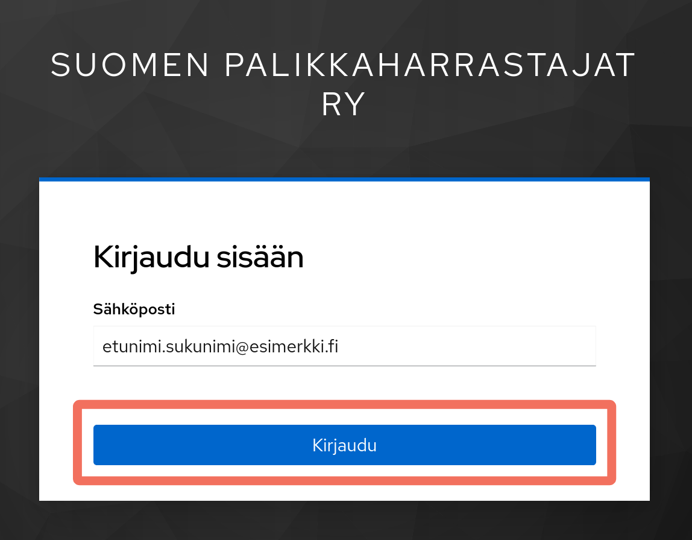
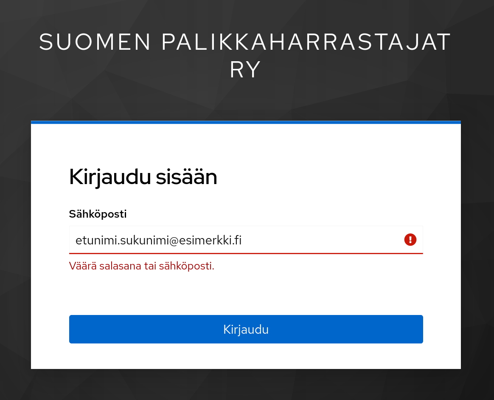
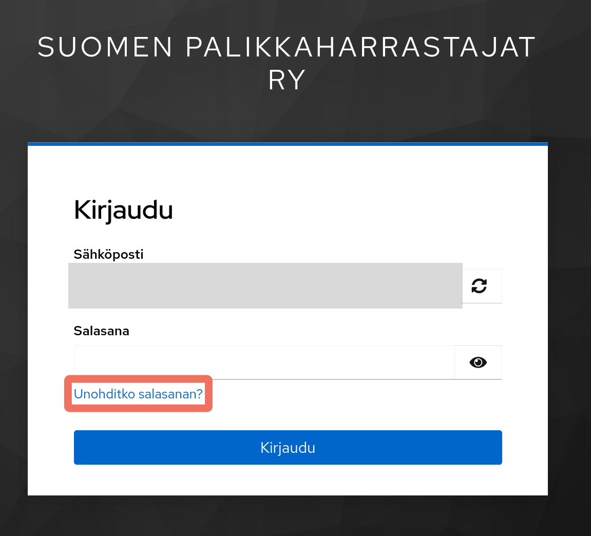
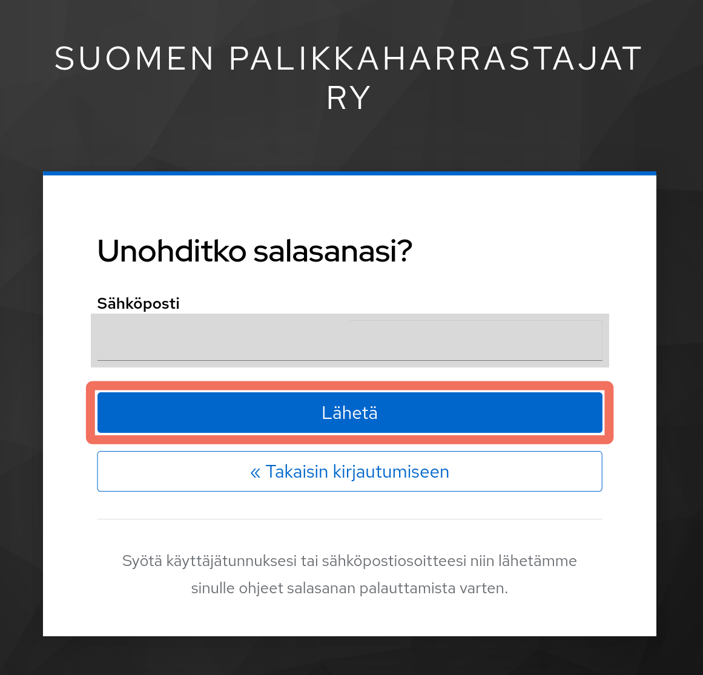
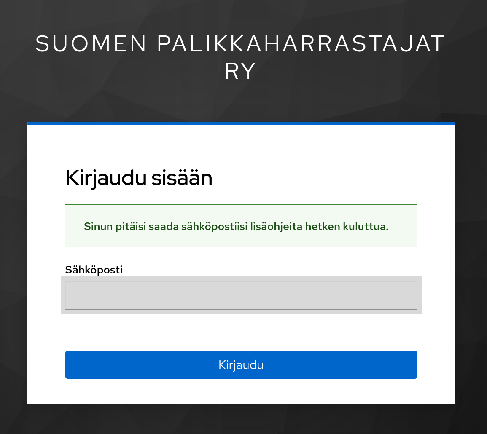
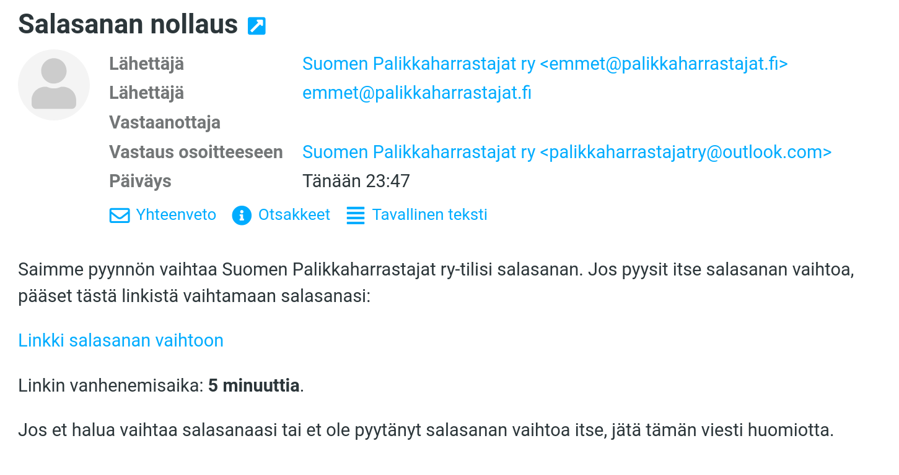
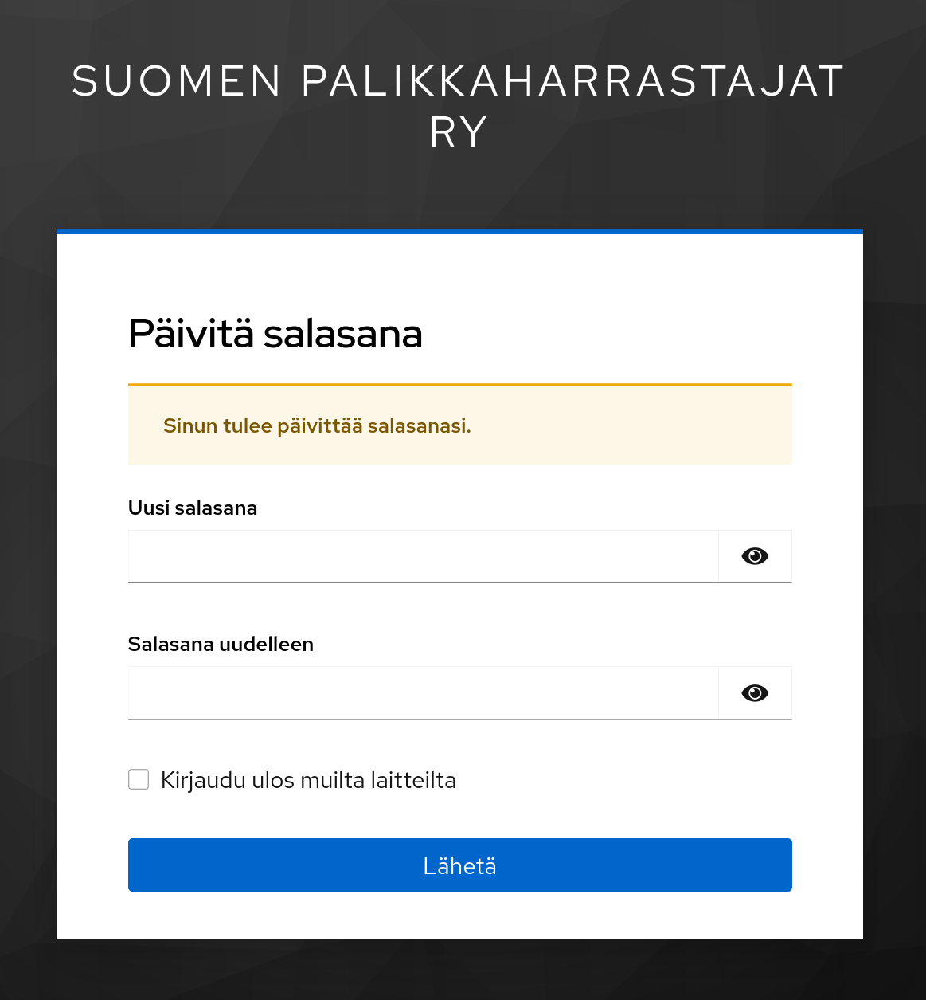
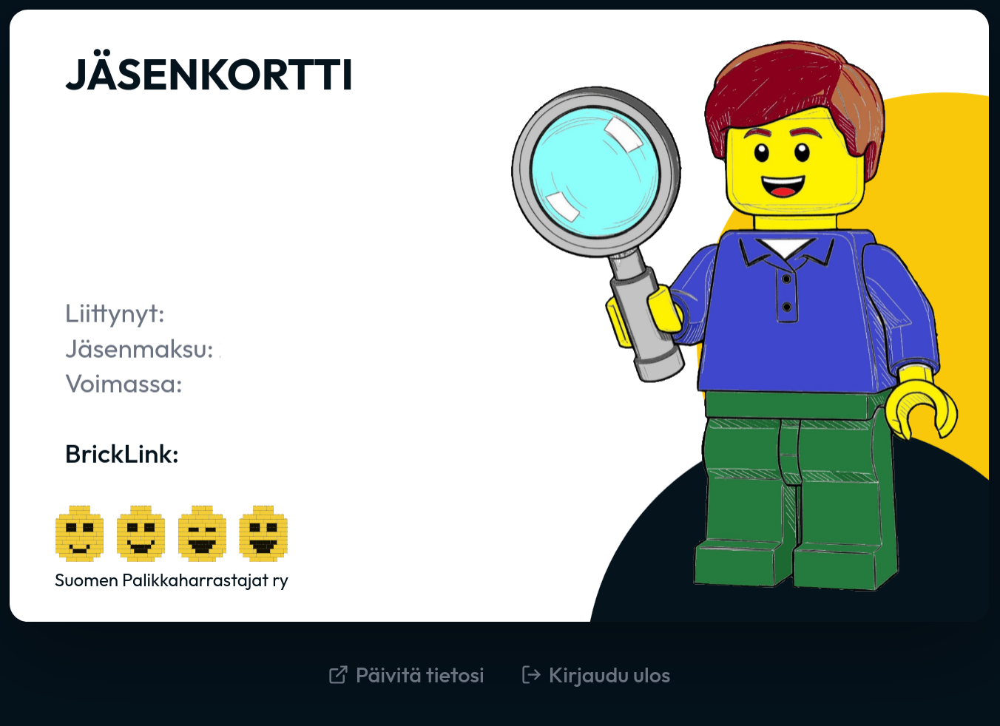
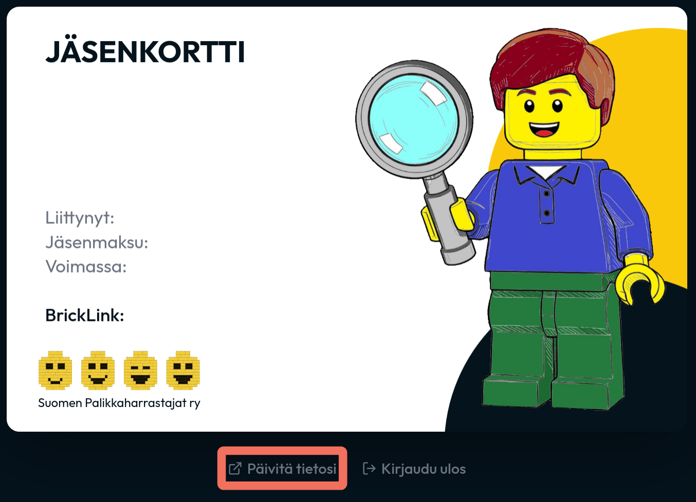

# Jäsenkortti

Suomen Palikkaharrastajat ry:n sähköinen jäsenkortti löytyy osoitteesta: [https://kortti.palikkaharrastajat.fi](https://kortti.palikkaharrastajat.fi)

Jäsenkortista voit tarkistaa liittymispäiväsi, viimeisimmän jäsenmaksupäiväsi.

Yhdistyksen sääntöjen mukaan yhdistyksen kokouksissa on äänioikeus jäsenellä, joka on täyttänyt 15 vuotta ja maksanut kuluvan jäsenkauden jäsenmaksun viimeistään ennen kokouksen alkua.

Lisäksi jäsen katsotaan eronneeksi, jos hän ei ole kalenterivuoden loppuun mennessä maksanut vuodelle määrättyä jäsenmaksua.

## Kirjautuminen

Kirjautuminen keskustelualueelle tapahtuu linkistä *Kirjaudu sisään*.

Kirjautuminen tapahtuu yhdistyksen jäsenrekisteriin ilmoitetulla sähköpostiosoitteella.

Jos kirjautuminen antaa virheen *Väärä salasana tai sähköposti* jo pelkän sähköpostiosoitteen syöttämisen jälkeen, ota yhteyttä: [palikkaharrastajatry@outlook.com](mailto:palikkaharrastajatry@outlook.com).

Tämä virhe tarkoittaa, että sähköpostiosoitteesi puuttuu vielä yhdistyksen jäsenrekisteristä.

Tunnistetun sähköpostiosoitteen syöttämisen jälkeen voit joko syöttää aikaisemmin asettamasi salasanan tai valita **Unohditko salasanan?**, jolloin voit joko asettaa ensimmäisen tai vaihtaa aikaisemman salasanasi.

Salasanan vaihtaminen onnistuu pyytämällä seuraavalta lomakkeelta pienen hetken voimassaoleva linkki sähköpostiin.

Sähköpostin pitäisi tulla nopeasti ja siinä oleva linkki on voimassa vain hetken. Muista kaiken varalta seurata myös roskapostikansiota.

Sähköpostissa on linkki **Linkki salasanan vaihtoon**, joka johtaa osoitteeseen **https://lemur-14.cloud-iam.com/auth/realms/suomenpalikkaharrastajatry/login-actions/action-token?key=...**

Muista syöttää sellainen salasana tai salalause, jonka muistat tai pidät jossain tallessa, mutta jota käytä missään muussa palvelussa.

Seuraavaksi oletkin jo perillä, ja voi tarkistaa jäsentietosi.

Huomaa, että yhdistys voi muuttaa jäsenkortin ulkoasua ajan myötä.

Voit muuttaa jäsenkortissa näkyviä tietoja lähettämällä yhdistyksellä sähköpostia osoitteeseen [palikkaharrastajatry@outlook.com](mailto:palikkaharrastajatry@outlook.com) tai jäsenkortin linkistä *Päivitä tietosi*.

